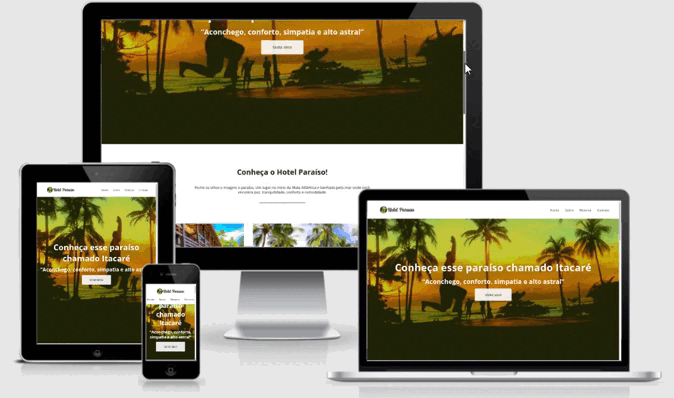

# Hotel-Paraiso-Layout-Responsivo-com-Flexbox
Layout Responsivo de um site do curso  Flex Box do NodeStudio - Treinamentos. 
No qual foram aplicados em sua construção propriedades de Flexbox e os conceitos de typical Device Breakpoints para garantir a responsividade em diferentes resoluções de tela.

<a href="https://guilherme-rsm.github.io/Hotel-Paraiso-Layout-Responsivo-com-Flexbox/">Clique aqui para visualizar no Github Pages</a>
